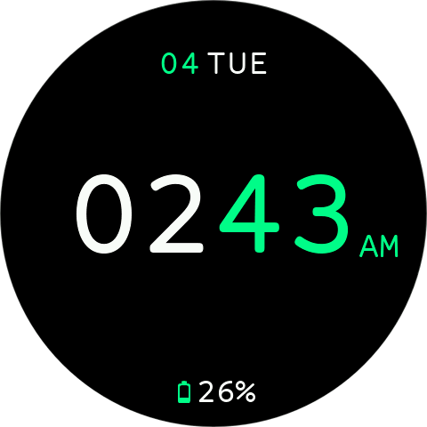
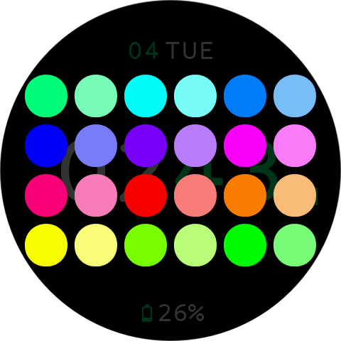
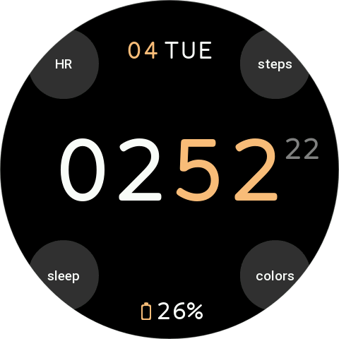

# Greenpler — Watchface for Zepp OS

Greenpler is a lightweight, optimized watchface for Zepp OS, initially developed for the Balance and Balance 2 watches. It can also be used on other compatible smartwatches that meet the requirements below.

## Requirements
- Platform: Zepp OS
- Minimum API: 3.6
- Screen size: 480 (round)

## Main features
- Time display (hours and minutes) with a clean, optimized layout and a long-press shortcut to Alarms.
- Separate seconds display with shortcuts: tap to open Countdown and long-press to open Stopwatch.
- Date (day of month) and day-of-week display with a shortcut to the Calendar.
- Battery indicator with level bar and shortcut to battery settings/usage.
- Hidden (invisible) shortcut buttons for:
  - Heart rate (HR)
  - Step counter
  - Sleep monitor
  - Open the layout color picker (change text colors)

## Color picker behavior
- The color picker is created on demand (lazy-create) to reduce memory usage while the watchface is active.
- After selection, the chosen color is applied to visible text elements and the picker is destroyed to free memory.

## Design and performance
- Code is designed for low power consumption: updates occur only when needed (per minute/second as configured).
- Widgets are created only when required and removed after use to minimize memory footprint and improve battery life.
- Font sizes and placement are prioritized for readability on 480 round screens.

## Localization
- The watchface includes localization for:
  - English
  - Portuguese
  - Chinese (Simplified & Traditional)
  - Japanese
  - Korean

## Contributing and customization
- The code is organized to make palette, layout, and font-size adjustments easy.

## Downloads & Links
- Download (zip): [greenpler-480-round-v1.0.0.zip](./releases/v1.0.0/greenpler-480-round-v1.0.0.zip)
- Release notes: [release-notes-v1.0.0.md](./releases/v1.0.0/release-notes-v1.0.0.md)
- Release metadata: [greenpler-v1.0.0.json](./releases/v1.0.0/greenpler-v1.0.0.json)
- GitHub Releases (upload/releases page): https://github.com/laeljd/greenpler/releases

## Screenshots / Preview

## License
- Check repository license files (if any) before redistributing.

